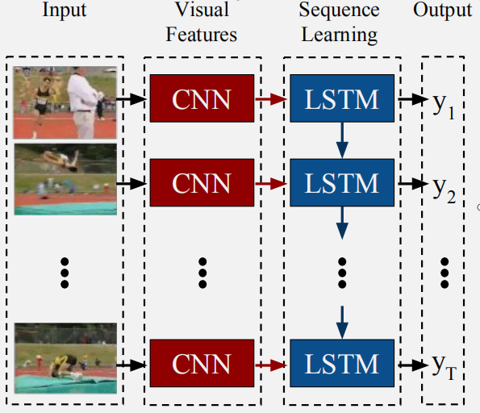
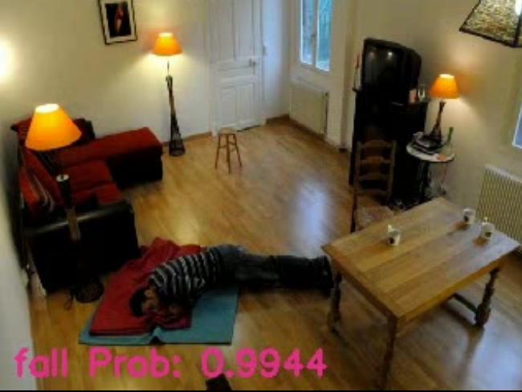

# Fall Detection in Videos Using LRCN
<!-- TOC -->

- [Fall Detection in Videos Using LRCN](#fall-detection-in-videos-using-lrcn)
    - [1. 项目概述](#1-项目概述)
    - [2. 数据预处理](#2-数据预处理)
    - [3. LRCN model overview](#3-lrcn-model-overview)
    - [4. 训练模型](#4-训练模型)
    - [5. 验证模型](#5-验证模型)

<!-- /TOC -->

### 1. 项目概述
&emsp;&emsp;我参考[论文](https://arxiv.org/abs/1411.4389)实现了搭建LRCN模型，
并将模型在[Le2i Fall detection Dataset](http://le2i.cnrs.fr/Fall-detection-Dataset?lang=fr)
数据集上进行训练，所构建的LRCN模型可以对视频中发生的人的跌倒行为进行识别。 但是在某些动作如弯腰或其他类型视频文件出现的时候，模型的准确率会发生变化，这种情况取决于每个动作的类别帧数以及训练样本的丰富性。

### 2. 数据预处理
&emsp;&emsp;使用的Le2i Fall detection Dataset视频数据中，只有部分视频具有跌倒动作，具体数据形式在[这里](https://www.yuque.com/nalaeur/bstyo8/pyacvh)，将原始数据存放在root_dir文件夹中，数据预处理阶段，将视频数据按照clip_len大小的滑窗连续采样切分为图片，处理后数据存储在output_dir文件夹中，这个过程只运行现一次。<br>
&emsp;&emsp;原始数据存储的格式为:<br>
```
root_dir
|_ Coffee_room_02
|  |_ [Videos]
|  |  |_ video (49).avi
|  |  |_ video (50).avi
|  |  |_ ...
|  |_ [Annotation_files]
|     |_ video (49).txt
|     |_ video (50).txt
|     |_ ...
```

### 3. LRCN 模型概述

- LCRN模型可以实现视频中人的跌倒动作识别。<br>
- 视频帧由预先训练的ResNet18提取图像特征，随后使用双向LSTM层处理，并在LSTM层输出结果，该模型实现了CNN+LSTM框架,训练好的模型将保存在save_dir中。
- 网络输入的是呈现人类活动的视频一小段，输出的是跌倒的概率向量。


### 4. 训练模型
```
    python script/train.py  --root_dir /hdd01/lc/Le2i/Video \          # 原始视频数据
                            --out_dir  /hdd01/lc/Le2i/Video_split \    # 预处理文件保存
                            --save_dir /hdd01/lc/fall/save \           # 模型保存地址
                            --clip_len  4                              # 滑动窗口大小
```

### 5. 验证模型
```
    python script/inference.py  --checkpoint  /save/Le2i_epoch-45.pth.tar \   # 保存的模型 
                                --input  /demo/input.mp4                     # 测试的文件
```
&emsp;&emsp;最终在GPU所得fps = 20，CPU所得fps=20




